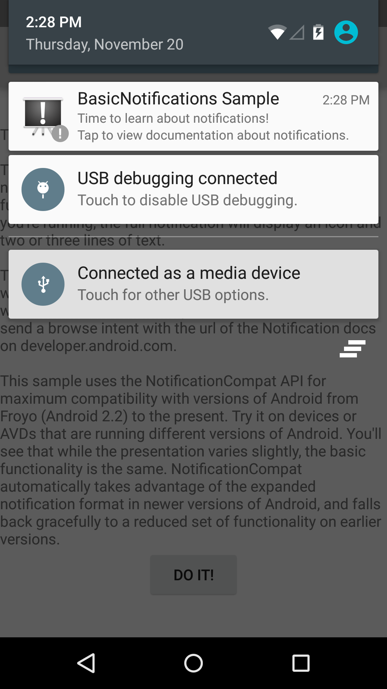
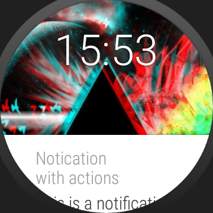
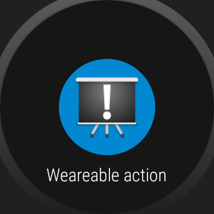

Android BasicNotifications Sample
===================================

A basic app showing how to display events in the system's notification bar and wearables using
the NotificationCompat API.
NotificationCompat API is used for compatibility with older devices, running Android
1.6 (Donut) (API level 4) or newer.

This app was based on the basic notification example provided by Android Studio and it was added some additional examples for using android wear.


Pre-requisites
--------------

- Android SDK 25
- Android Build Tools v25.0.2
- Android Support Repository


For using the Emulator
----------------------

*  Install the "Android wear" application in your phone.
*  Turn on the Android wear emulator.
*  Connect the connect the phone with the emulator by using the Android wear application.
*  While the connection is being established, run the following command in the terminal console:  ```adb -d forward tcp:5601 tcp:5601 command```

In general the adb tool is located in ```C:\ Users\XXXXX\AppData\Local\Android\sdk\platform-tools\```
 


Screenshots
-------------

 



Examples
--------

 - Basic Notification
 
    This example will trigger a notification which will be visible in both the phone and the wearable. By clicking on the notication an Intenert page will be shown on the phone.
    
````java
         public void sendBasicNotification(View view) {
        
             
                Intent intent = new Intent(Intent.ACTION_VIEW, Uri.parse("http://developer.android.com/reference/android/app/Notification.html"));
                PendingIntent pendingIntent = PendingIntent.getActivity(this, 0, intent, 0);
                
                NotificationCompat.Builder builder = new NotificationCompat.Builder(this);
                builder.setSmallIcon(R.drawable.ic_stat_notification);
                builder.setContentIntent(pendingIntent);
                builder.setAutoCancel(true);
                builder.setLargeIcon(BitmapFactory.decodeResource(getResources(), R.drawable.ic_launcher));
                builder.setContentTitle("BasicNotifications Sample");
                builder.setContentText("Time to learn about notifications!");
                builder.setSubText("Tap to view documentation about notifications.");
        
                
                NotificationManagerCompat notificationManager= NotificationManagerCompat.from(getApplicationContext());
                notificationManager.notify(BASIC_NOTIFICATION_ID, builder.build());
               
            }
```` 

- Notification with an Action
  
  This example will trigger a notification which will be visible in both the phone and the wearable. 
 By clicking on the notication an Intenert page will be shown on the phone.
 Additionally there will be an action button which trigger the android map on the phone. This action will be visible in both the phone and the wearable.
 
 
````java
       public void sendAccionsNotification(View view) {
       
               String location="Vienna";
       
       
       
               Intent intent = new Intent(Intent.ACTION_VIEW, Uri.parse("http://developer.android.com/reference/android/app/Notification.html"));
               PendingIntent viewPendingIntent = PendingIntent.getActivity(this, 0, intent, 0);
       
       
       
               Intent mapIntent = new Intent(Intent.ACTION_VIEW);
               Uri geoUri = Uri.parse("geo:0,0?q=" + Uri.encode(location));
               mapIntent.setData(geoUri);
               PendingIntent mapPendingIntent =PendingIntent.getActivity(this, 0, mapIntent, 0);
       
               NotificationCompat.Builder notificationBuilder =
                       new NotificationCompat.Builder(this)
                               .setSmallIcon(R.drawable.ic_stat_notification)
                               .setContentTitle("Notication with actions")
                               .setContentText("This is a notification which has an action")
                               .setContentIntent(viewPendingIntent)
                               .addAction(R.drawable.ic_launcher, "Mapa" ,mapPendingIntent);
       
     
               NotificationManagerCompat notificationManager= NotificationManagerCompat.from(getApplicationContext());
      
               notificationManager.notify(ACTIONS_NOTIFICATION_ID, notificationBuilder.build());
       
           }
  ````
        

- Wearable Action Notification

  This example will trigger a notification which will be visible in both the phone and the wearable. 
 By clicking on the notication an Intenert page will be shown on the phone.
 Additionally there will be an action button will be visible only on the phone and action button which will be visible only on the wearable.
 
 
````java
 public void sendWeareableActionNotification(View view){
 
         // when a wearable sepcific action is added  the regular added action are shown only in the phone and the wereable specific action are shown only on the wereable.
         String location="Vienna";
 
         Intent intent = new Intent(Intent.ACTION_VIEW, Uri.parse("http://developer.android.com/reference/android/app/Notification.html"));
         PendingIntent viewPendingIntent = PendingIntent.getActivity(this, 0, intent, 0);
 
         //Intent fpr triggering the actions
         Intent mapIntent = new Intent(Intent.ACTION_VIEW);
         Uri geoUri = Uri.parse("geo:0,0?q=" + Uri.encode(location));
         mapIntent.setData(geoUri);
         PendingIntent mapPendingIntent =PendingIntent.getActivity(this, 0, mapIntent, 0);
 
         // Create an action for the weareable
         NotificationCompat.Action action= new NotificationCompat.Action.Builder(R.drawable.ic_launcher, "Weareable action",mapPendingIntent).build();
 
         NotificationCompat.Builder notificationBuilder =
                 new NotificationCompat.Builder(this)
                         .setSmallIcon(R.drawable.ic_stat_notification)
                         .setContentTitle("Notication with actions")
                         .setContentText("This is a notification which has an action")
                         .setContentIntent(viewPendingIntent)
                         .addAction(R.drawable.ic_launcher, "Mapa Phone" ,mapPendingIntent) // This action is shown only on the phone
                         .extend(new NotificationCompat.WearableExtender().addAction(action)); // This action is shown only on the weareable
 
 
         NotificationManagerCompat notificationManager= NotificationManagerCompat.from(getApplicationContext());
 
         notificationManager.notify(WEAREABLE_ACTION_NOTIFICATION_ID, notificationBuilder.build());
 
     }
````

- Big Style Notification

  This example will trigger a notification which will be visible in both the phone and the wearable.
  The notification will shown additional information when it is expanded.
 
````java
  
  public void sendBigStyleNotification (View view){
  
  
          NotificationCompat.BigTextStyle bigStyle= new NotificationCompat.BigTextStyle();
          bigStyle.bigText("Big text event descrption. To show additional information");
  
          NotificationCompat.Builder builder = new NotificationCompat.Builder(this)
                  .setSmallIcon(R.drawable.ic_stat_notification)
                  .setContentTitle("Notication with actions")
                  .setSmallIcon(R.drawable.ic_stat_notification)
                  .setContentText("This is a notification which has an action")
                  .setStyle(bigStyle);
  
  
          NotificationManagerCompat notificationManager= NotificationManagerCompat.from(getApplicationContext());
          notificationManager.notify(BIG_STYLE_ACTION_NOTIFICATION_ID, builder.build());
  
      }
````
   

- Notification with background image

  This example will trigger a notification which will be visible in both the phone and the wearable however the wearable will show an image in the background.
 
````java
  
  public void sendBackgroundNotification (View view){
  
          Bitmap bitmap=BitmapFactory.decodeResource(getResources(),R.drawable.background_400);
  
  
          //Create a WearableExtender to add functionality for wearables
          NotificationCompat.WearableExtender wearableExtender= new NotificationCompat.WearableExtender()
                  .setHintHideIcon(true)
                  .setBackground (bitmap);
  
  
          NotificationCompat.Builder builder = new NotificationCompat.Builder(this)
                  .setSmallIcon(R.drawable.ic_stat_notification)
                  .setContentTitle("Notication with actions")
                  .setSmallIcon(R.drawable.ic_stat_notification)
                  .setContentText("This is a notification which has an action")
                  .extend(wearableExtender);
  
  
          NotificationManagerCompat notificationManager= NotificationManagerCompat.from(getApplicationContext());
          notificationManager.notify(BACKGROUND_ACTION_NOTIFICATION_ID, builder.build());
  
  
      }
````


- Notification with several pages

  This example will trigger a notification which will be visible in both the phone and the wearable however the wearable will have 2 Pages.
 
````java
 public void sendPagesNotification(View view){

         // create a big style for the second page
         NotificationCompat.BigTextStyle secondPageStyle= new NotificationCompat.BigTextStyle();
         secondPageStyle.setBigContentTitle("Page 2");
         secondPageStyle.bigText("This is the text which is going to be displayed in the second page. Usually it must have a lot of text....");
 
         // Create the builder for the second page
         Notification secondPageNotification= new NotificationCompat.Builder(this)
                 .setStyle(secondPageStyle)
                 .build();
 
         //Create the wearable extender which has the second page
         NotificationCompat.WearableExtender wearableExtender= new NotificationCompat.WearableExtender()
                 .addPage (secondPageNotification);
 
 
         //Create the builder for the main notification
         NotificationCompat.Builder mainBuilder = new NotificationCompat.Builder(this)
                 .setSmallIcon(R.drawable.ic_stat_notification)
                 .setContentTitle("Page 1")
                 .setSmallIcon(R.drawable.ic_stat_notification)
                 .setContentText("This is a notification which has a second page")
                 .extend(wearableExtender);
 
 
 
         //Issue the notification
         NotificationManagerCompat notificationManager= NotificationManagerCompat.from(getApplicationContext());
         notificationManager.notify(PAGES_ACTION_NOTIFICATION_ID, mainBuilder.build());
 
 
     }
````